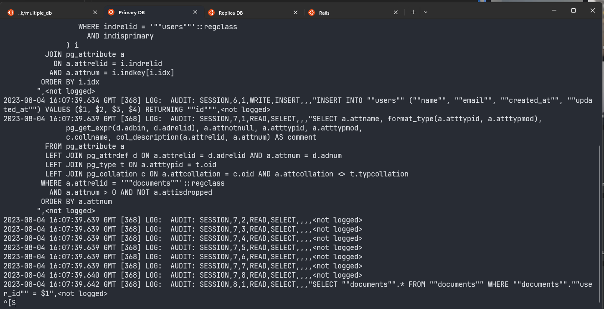
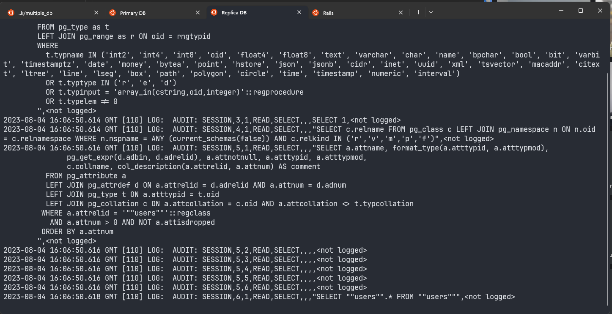
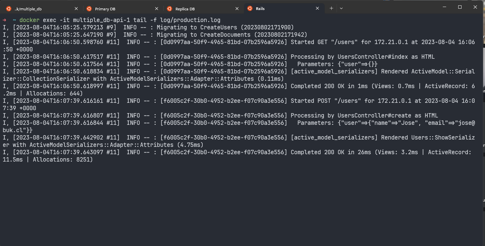

## Iniciar App
Para levantar la aplicacion en modo produccion correr el siguiente comando

Le puedes agregar el flag -d para levantar los contenedores en modo detach

```
docker-compose -f docker-compose.prod.yml up --build
```

## Probar API
Para probar api puedes usar la extension [REST Client](https://marketplace.visualstudio.com/items?itemName=humao.rest-client) con el archivo `request-example.http`

## Screenshots
Algunos screen shots de los logs de la database primaria, replica y la aplicacion de rails

### Primary DB
(Aqui se hace un select a documents ya que esta dentro del insert, cuando se hace solo select se usa la db replica)


### Replica DB


### Rails App


